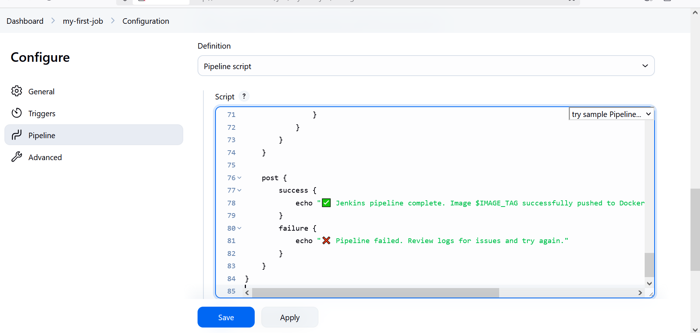
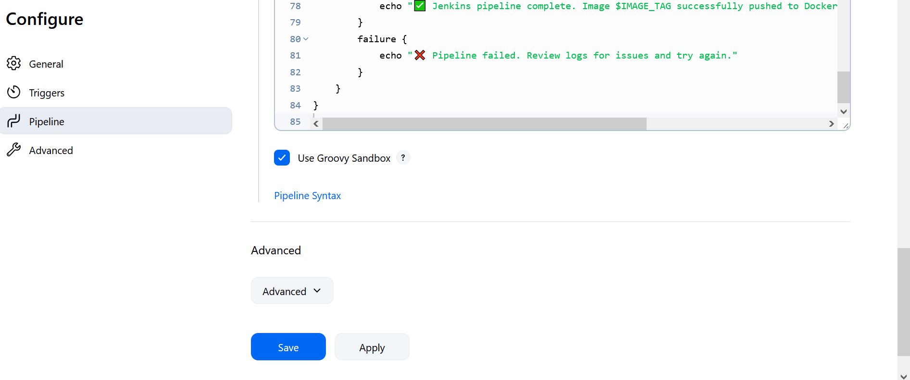
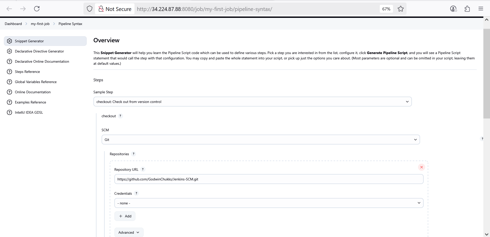
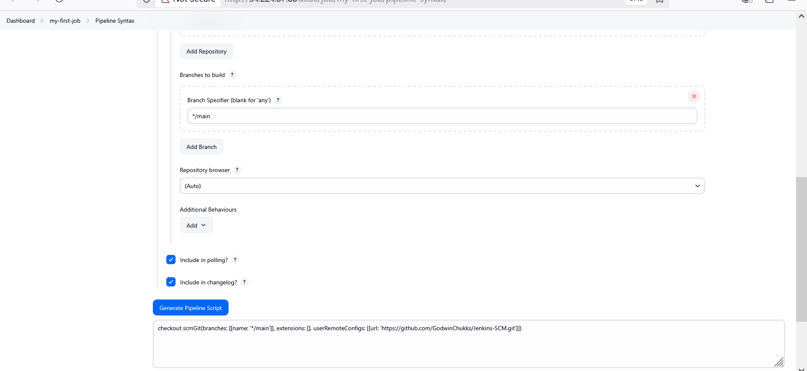
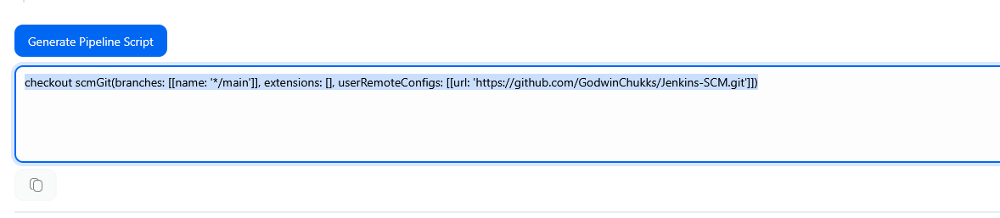
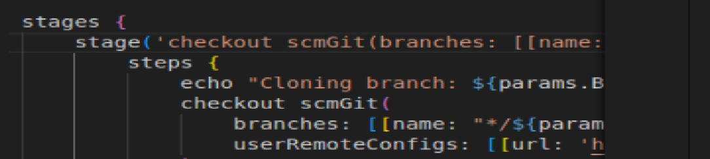
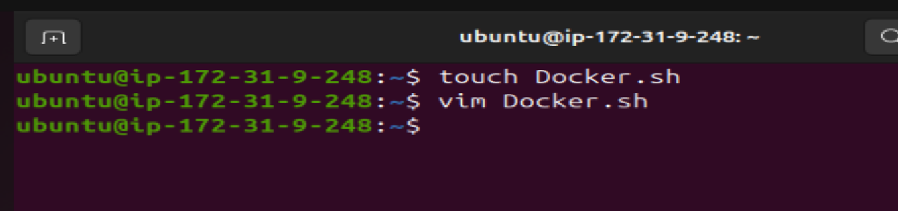
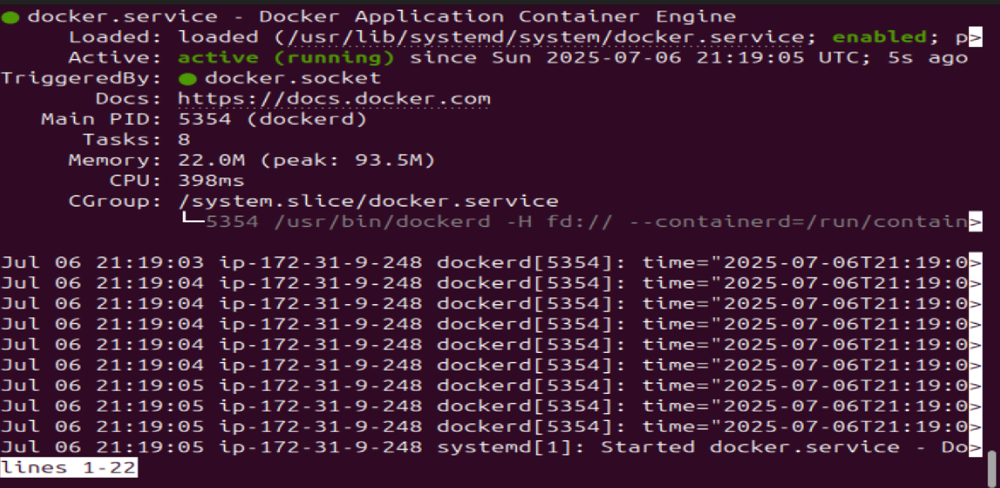

## Jenkins Job

### In Jenkins, a job is a unit of work or a task that can be executed by the Jenkins automation server.

### A Jenkins job represents a specific task or set of tasks that needs to be performed as part of a build or deployment process. Jobs in Jenkins are created to automate the execution of various steps such as compiling code, running tests, packaging applications, and deploying them to servers. Each Jenkins job is configured with a series of build steps, post-build actions, and other settings that define how the job should be executed.

## Creating a Freestyle Project

### 1.  From the dasboard on the left side, click on new


### 2. Creating a freestyle project with name  "my-first-job"


## Connecting Jenkins To Our Source Code Management


### Now that we have created a freestyle project, let connect jenkins with github.

### 1. Create a new github repository called jenkins-scm with a README.md file


### 2. Connecting jenkins to jenkins-scm repository by pasting the repository url in the area selected below, and ensuring  current branch is set to main


### 3. Save configuration and run "build now" to connect jenkins to our repository

### Jenkins successfully connects to Github repository (Jenkins-SCM) and built freestyle job


## Configuring Build Trigger

### As an engineer, we need to be able to automate things and make our work easier in possible ways. We have connected jenkins to jenkins-scm, but we cannot run a new build with clicking on Build Now. To eliminate this, we need to configure a build trigger to our jenkins job. With this, jenkins will run a new build anytime a change is made to our github repository

### 1. Clicking on "Configure" your job and add this configurations


### 2. configuring build trigger to configure triggering the job from GitHub webhook


### 3. Creating Github webhook


### Github webhook configured


### Successfully configured Github webhook


### After change was made on the Github file and pushed to Github. A new build was triggered automatical


## Writing Jenkins Pipeline Script

### A jenkins pipeline script refers to a script that defines and orchestrates the steps and stages of a continuous integration and continuous delivery (CI/CD) pipeline. Jenkins pipelines can be defined using either declarative or scripted syntax. Declarative syntax is a more structured and concise way to define pipelines. It uses a domain-specific language to describe the pipeline stages, steps, and other configurations while scripted syntax provides more flexibility and is suitable for complex scripting requirements.

### Let's write our pipeline script

```
pipeline {
    agent any

    parameters {
        string(name: 'BRANCH', defaultValue: 'main', description: 'Git branch to build from')
    }

    environment {
        IMAGE_TAG = "godwinchukks/godwin_image:${BUILD_NUMBER}"
        CONTAINER_NAME = "godwin_container"
    }

    stages {

        stage('Clone Repository') {
            steps {
                echo "📥 Cloning from branch: ${params.BRANCH}"
                checkout scmGit(
                    branches: [[name: "*/${params.BRANCH}"]],
                    userRemoteConfigs: [[url: 'https://github.com/GodwinChukks/Jenkins-SCM.git']]
                )
            }
        }

        stage('Verify Workspace') {
            steps {
                echo '🔍 Verifying files in the workspace...'
                sh 'ls -la'
            }
        }

        stage('Build Docker Image') {
            steps {
                echo "🔧 Building Docker image: $IMAGE_TAG"
                sh "docker build -t $IMAGE_TAG ."
            }
        }

        stage('Debug Environment') {
            steps {
                echo '🧠 Printing environment info...'
                sh 'env'
            }
        }

        stage('Cleanup Container') {
            steps {
                echo "🧹 Checking for previous container: $CONTAINER_NAME"
                sh """
                    docker stop $CONTAINER_NAME || true
                    docker rm $CONTAINER_NAME || true
                """
            }
        }

        stage('Run Docker Container') {
            steps {
                echo "🚀 Starting container: $CONTAINER_NAME"
                sh "docker run -itd --name $CONTAINER_NAME -p 8081:80 $IMAGE_TAG"
            }
        }

        stage('Push to Docker Hub') {
            steps {
                echo "📦 Pushing image to Docker Hub..."
                withCredentials([usernamePassword(credentialsId: 'dockerhub-creds', usernameVariable: 'DOCKER_USER', passwordVariable: 'DOCKER_PASS')]) {
                    sh "echo $DOCKER_PASS | docker login -u $DOCKER_USER --password-stdin"
                    sh "docker push $IMAGE_TAG"
                }
            }
        }
    }

    post {
        success {
            echo "✅ Pipeline ran successfully. Image $IMAGE_TAG is live and container is running!"
        }
        failure {
            echo "❌ Pipeline failed. Please check the logs and fix the issue."
        }
    }
}

```

## What the Top Section Does

### `agent any` Tells Jenkins to run this pipeline on any available server (agent). You’re not being picky.

### `parameters` Adds a text box before the job runs so you can choose which branch of your Git repo to use. Default is `main`.

### `environment` Sets up two reusable names:

- `IMAGE_TAG`: The name and version of your Docker image

- `CONTAINER_NAME`: What your running container will be called


## Pipeline Stages – Step-by-Step
**Clone Repository**
### Pulls your code from GitHub based on the branch you choose It uses checkout to bring all the files into Jenkins so the pipeline can use them.

**Verify Workspace**
### Lists all the files Jenkins downloaded It's a simple check to see that everything's there before moving forward.

**Build Docker Image**
### Takes your app code + Dockerfile and bundles it into a Docker image This image will later be pushed and deployed—it’s your app in a container box.

**Debug Environment**
### Shows all system info Jenkins has during the build You’ll see paths, variables, and settings in case something goes wrong later.

**Cleanup Container**
### Removes any leftover container with the same name This avoids errors like “container already exists” during deployment. Smart housekeeping.

**Run Docker Container**
### Starts a new container using the image you just built It opens port 8081 so your app can be viewed in a browser.

**Push to Docker Hub**
### Logs in to Docker Hub using your saved credentials and uploads your image This makes the image available anywhere—great for sharing or deployments.

**Post Block**
### Runs after the pipeline is finished:

- If all stages succeed, it prints a “success” message 

- If anything fails, it shows a “failure” alert with a friendly nudge to check your logs

### Pasting pipeline script


### The stage one of this script connect Jenkins to Github repository .To generate a syntax for our repository 

### 1. click on the pipeline syntax



### 2. Selcect the drop down to search for `checkout: check out from version control`



Generating our pipeline script by clicking on Generate Gipeline Script



### 3. Copy the generated pipeline script and replace it with the connect Jenkins to Github on stage one in the Jenkins file






## Install Docker


### Before jenkins can run docker commands, we need to install docker on the same instance jenkins was installed. From our shell scripting knowledge, let's install docker with shell script. We shall

### i. Create a file named docker.sh

### ii. Open the file and paste the script below

```
sudo apt-get update -y
sudo apt-get install ca-certificates curl gnupg
sudo install -m 0755 -d /etc/apt/keyrings
curl -fsSL https://download.docker.com/linux/ubuntu/gpg | sudo gpg --dearmor -o /etc/apt/keyrings/docker.gpg
sudo chmod a+r /etc/apt/keyrings/docker.gpg

# Add the repository to Apt sources:
echo \
  "deb [arch=$(dpkg --print-architecture) signed-by=/etc/apt/keyrings/docker.gpg] https://download.docker.com/linux/ubuntu \
  $(. /etc/os-release && echo "$VERSION_CODENAME") stable" | \
  sudo tee /etc/apt/sources.list.d/docker.list > /dev/null
sudo apt-get update -y
sudo apt-get install docker-ce docker-ce-cli containerd.io docker-buildx-plugin docker-compose-plugin -y
sudo systemctl status docker

```

### iii. Save and close the file

### iv. Make the file executable

`chmod u+x docker.sh`


### v. Execute the file

`./docker.sh`


### We have succefully install Docker



### Docker is running




## Building Pipeline Script

### Now that we have docker installed on the same instance with jenkins, we need to create a dockerfile before we can run our pipeline script. As we know, we cannot build a docker image without a dockerfile. Let's recall the dockerfile we used to build a docker image in our docker foundations. In the main branch on jenkins-scm,

### i. Create a new file named dockerfile

### ii. Paste the code snippet below in the file

```
# Use the official NGINX base image
FROM nginx:latest

# Set the working directory in the container
WORKDIR  /usr/share/nginx/html/

# Copy the local HTML file to the NGINX default public directory
COPY index.html /usr/share/nginx/html/

# Expose port 80 to allow external access
EXPOSE 80

```

### iii. create an `index.html` file and paste the content: `Congratulations, You have successfully run your first pipeline code.`


## Pushing this files `dockerfile` and `index.html` will trigger Jenkins to automatically run a new build for our pipeline.


### Build Succesfully Executed


Accessing the Application via web browser


### Confirming build on terminal


### Confirming image was successfully push to Docker Hub


## DEBUGGING

### Jenkins return this error when running the build:

`chmod: cannot access 'docker.sh': No such file or directory`

## How to fix it

- Make sure docker.sh exists in your GitHub repository

- Navigate to your GitHub repo and confirm that docker.sh is located in the root directory (same level as your Jenkinsfile)

- If it’s in a subfolder (e.g. scripts/docker.sh), update your script:

- Confirm Jenkins is checking out the latest code by adding this diagnostic in your “Clone Repository” stage: `sh 'ls -la'`
It will list all files in the Jenkins workspace after checkout so you can confirm docker.sh is present.

- Add a fail-safe check to avoid pipeline crashing You could tweak the stage like this for graceful handling:

```
stage('Install Docker') {
    steps {
        script {
            if (fileExists('docker.sh')) {
                sh 'chmod +x docker.sh && ./docker.sh'
            } else {
                error("docker.sh not found. Make sure it's in the repo root.")
            }
        }
    }
}

```

## Jenkins return `sudo: a password is required` error when running the pipeline script.

### means your docker.sh script uses sudo commands, but Jenkins runs in a non-interactive shell where it cannot prompt for a password.

## How to Fix It

### Option 1: Remove sudo from docker.sh
### If Jenkins is already running with root privileges or has Docker access, edit your docker.sh and remove all sudo commands.

### Option 2: Pre-install Docker manually
### Instead of installing Docker during the pipeline, SSH into your Jenkins server and install it directly:

``
sudo apt update
sudo apt install docker.io -y
sudo usermod -aG docker jenkins
sudo systemctl restart jenkins

```

### Then remove the entire `Install Docker` stage from your Jenkinsfile—it won’t be needed anymore. and delete the docker.sh script that suppose to install docker.

## Permission denied: Unable to open /var/lib/apt/lists/lock … are you root?

### Cause: Your docker.sh script is trying to install packages using apt, but the Jenkins user doesn’t have root privileges during pipeline execution.

## How to fix it 

### Pre-install Docker manually SSH into your server and run:

``
sudo apt update
sudo apt install docker.io -y
sudo usermod -aG docker jenkins
sudo systemctl restart jenkins

``

## permission denied while trying to connect to the Docker daemon socket

**Cause**: The Jenkins user doesn't have permission to run Docker commands.

**Fix**: Make sure Jenkins is in the Docker group:

```
sudo usermod -aG docker jenkins
sudo systemctl restart jenkins

```

### Also verify the permissions:`ls -l /var/run/docker.sock` It ahould return `srw-rw---- 1 root docker ...` If Jenkins is in the docker group, it can access the socket.


## ERROR: Could not find credentials entry with ID 'dockerhub-creds'

### means Jenkins couldn’t locate a credential with the ID dockerhub-creds in its credential store.

## How to Fix It
### Here’s how to create the missing credential:

- Go to Jenkins Dashboard → Manage Jenkins → Credentials

- Select (global) under “Stores scoped to Jenkins”

- Click Add Credentials

## Choose:

- Kind: Username and password

- Username: Your Docker Hub username

- Password: Your Docker Hub password or access token

- ID: dockerhub-creds ← this must match exactly

- Description: (optional, e.g. “Docker Hub login for pipeline”)

- Click Save


## How to Access Your App in the Browser

### Your Jenkins pipeline ran this command:

`docker run -itd --name godwin_container -p 8081:80 godwinchukks/godwin_image:6`

## This means:

- The app inside the container is listening on port 80

- It’s exposed to the host machine on port 8081

## So to access it:

### Use your server’s public IP and mapped port: `http://3.84.224.187:8081`

### Paste that into your browser and hit Enter. You should see the contents of your index.html file served by Nginx.


## If It Doesn’t Load
### Here are quick checks:

- Security Group (AWS EC2): Make sure port 8081 is open for inbound traffic.

- Firewall: Ensure nothing is blocking port 8081.

- Container Status: Run docker ps to confirm the container is still running.

- App Content: Your Dockerfile copies index.html to Nginx’s default path—make sure it’s valid HTML.


