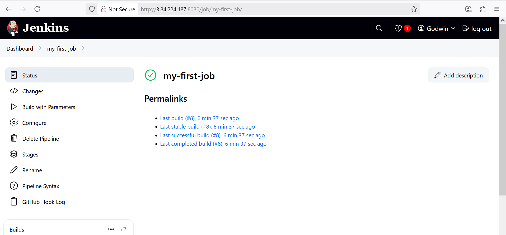
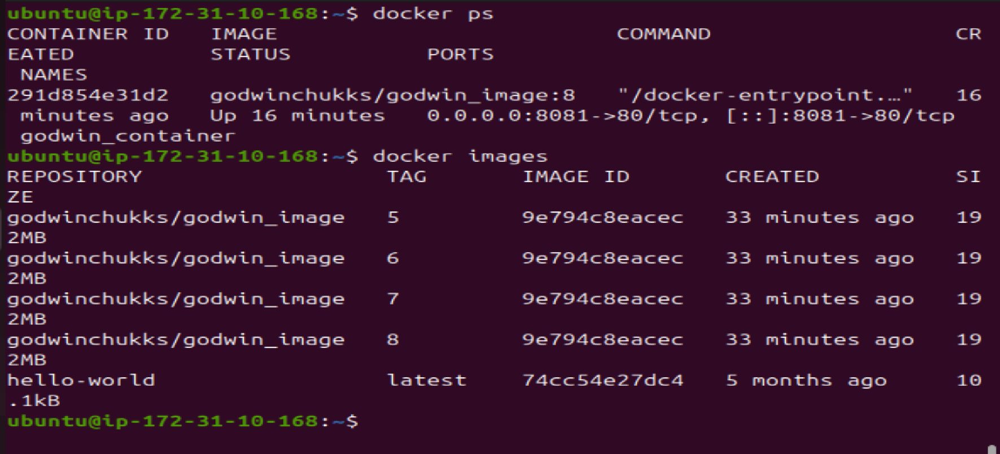

## Jenkins Job

### In Jenkins, a job is a unit of work or a task that can be executed by the Jenkins automation server.

### A Jenkins job represents a specific task or set of tasks that needs to be performed as part of a build or deployment process. Jobs in Jenkins are created to automate the execution of various steps such as compiling code, running tests, packaging applications, and deploying them to servers. Each Jenkins job is configured with a series of build steps, post-build actions, and other settings that define how the job should be executed.

## Creating a Freestyle Project

### 1.  From the dasboard on the left side, click on new


### 2. Creating a freestyle project with name  "my-first-job"


## Connecting Jenkins To Our Source Code Management


### Now that we have created a freestyle project, let connect jenkins with github.

### 1. Create a new github repository called jenkins-scm with a README.md file



### 2. Connecting jenkins to jenkins-scm repository by pasting the repository url in the area selected below, and ensuring  current branch is set to main





### 3. Save configuration and run "build now" to connect jenkins to our repository

### Jenkins successfully connects to Github repository (Jenkins-SCM) and built freestyle job


## Configuring Build Trigger

### As an engineer, we need to be able to automate things and make our work easier in possible ways. We have connected jenkins to jenkins-scm, but we cannot run a new build with clicking on Build Now. To eliminate this, we need to configure a build trigger to our jenkins job. With this, jenkins will run a new build anytime a change is made to our github repository

### 1. Clicking on "Configure" your job and add this configurations


### 2. configuring build trigger to configure triggering the job from GitHub webhook


### 3. Creating Github webhook


### Github webhook configured


### Successfully configured Github webhook


### After change was made on the Github file and pushed to Github. A new build was triggered automatical


## Writing Jenkins Pipeline Script

### A jenkins pipeline script refers to a script that defines and orchestrates the steps and stages of a continuous integration and continuous delivery (CI/CD) pipeline. Jenkins pipelines can be defined using either declarative or scripted syntax. Declarative syntax is a more structured and concise way to define pipelines. It uses a domain-specific language to describe the pipeline stages, steps, and other configurations while scripted syntax provides more flexibility and is suitable for complex scripting requirements.

### Let's write our pipeline script

```
pipeline {
    agent any

    parameters {
        string(name: 'BRANCH', defaultValue: 'main', description: 'Git branch to build from')
    }

    environment {
        IMAGE_TAG = "godwinchukks/godwin_image:${BUILD_NUMBER}"     // Unique tag per build
        CONTAINER_NAME = "godwin_container"
    }

    stages {
        stage('Connect to GitHub') {
            steps {
                echo "📥 Cloning branch: ${params.BRANCH}"
                checkout scmGit(
                    branches: [[name: "*/${params.BRANCH}"]],
                    userRemoteConfigs: [[url: 'https://github.com/RidwanAz/jenkins-scm.git']]
                )
            }
        }

        stage('Run Tests') {
            steps {
                echo '🧪 Running basic test checks...'
                sh 'ls -la'
                sh 'echo "Workspace files listed successfully."'
            }
        }

        stage('Build Docker Image') {
            steps {
                echo "🔧 Building Docker image: $IMAGE_TAG"
                sh "docker build -t $IMAGE_TAG ."
            }
        }

        stage('Debug Environment') {
            steps {
                echo '🧠 Showing environment variables...'
                sh 'env'
            }
        }

        stage('Cleanup Container') {
            steps {
                echo "🧹 Checking for existing container: $CONTAINER_NAME"
                sh """
                    docker stop $CONTAINER_NAME || true
                    docker rm $CONTAINER_NAME || true
                """
            }
        }

        stage('Run Docker Container') {
            steps {
                echo "🚀 Launching container: $CONTAINER_NAME"
                sh "docker run -itd --name $CONTAINER_NAME -p 8081:80 $IMAGE_TAG"
            }
        }

        stage('Push to Docker Hub') {
            steps {
                echo "📦 Pushing image to Docker Hub..."
                withCredentials([
                    usernamePassword(credentialsId: 'dockerhub-creds', usernameVariable: 'DOCKER_USER', passwordVariable: 'DOCKER_PASS')
                ]) {
                    sh "echo $DOCKER_PASS | docker login -u $DOCKER_USER --password-stdin"
                    sh "docker push $IMAGE_TAG"
                }
            }
        }
    }

    post {
        success {
            echo "✅ Jenkins pipeline complete. Image $IMAGE_TAG successfully pushed to Docker Hub!"
        }
        failure {
            echo "❌ Pipeline failed. Review logs for issues and try again."
        }
    }
}


```

## Explaining each stage:

## Connect to GitHub
T
- This stage pulls your project’s source code from your GitHub repository: 

- It uses the branch name defined by the user (main by default).

- The repository URL is hardcoded as https://github.com/RidwanAz/jenkins-scm.git.

- Jenkins clones this repo into the workspace so future stages can work with the files.

## Run Tests
- This performs a basic check to simulate testing:

- It lists all files in the workspace using ls -la.

- It confirms the workspace is correctly populated and outputs a status message.

- Great for early debugging and verification before a build.

## Build Docker Image

- This stage packages your application into a Docker image:

- It uses the current directory’s Dockerfile (docker build -t $IMAGE_TAG .).

- The image is named godwin_image:<build-number> for version tracking.

- This image includes everything your app needs to run.

## Debug Environment

- Used for troubleshooting the Jenkins environment:

- It dumps all environment variables using env.

- This helps diagnose issues like path errors, configuration problems, or secrets not loading.

## Cleanup Container

- Prevents conflict by removing old containers with the same name:

- If a container named godwin_container is already running, it stops and removes it.

- Uses safe logic (|| true) so it doesn’t fail the build if no container exists.

- Ensures clean deployment every time.

## Run Docker Container

- This runs your newly built Docker image as a container:

- It creates a container called godwin_container from your image.

- The -p 8081:80 flag maps host port 8081 to container port 80—perfect for accessing your app in a browser.

## Push to Docker Hub
- This uploads your Docker image to Docker Hub:

- Jenkins logs in using securely stored credentials (dockerhub-creds).

- Then it pushes your tagged image to the godwinchukks repository.

- Each pushed image is versioned by build number for traceability.

## post block

- Handles what happens after the pipeline finishes:

- If everything runs smoothly, it prints a success message.

- If any stage fails, it prints a failure message and invites you to review the logs.


### Copying the pipeline script and pasting

14

### The stage one of this script connect Jenkins to Github repository .To generate a syntax for our repository 

### 1. click on the pipeline syntax

15

### 2. Selcect the drop down to search for `checkout: check out from version control`

16

Generating our pipeline script by clicking on Generate Gipeline Script

17

### 3. Copy the generated pipeline script and replace it with the connect Jenkins to Github on stage one in the Jenkins file

18

19


## Install Docker


### Before jenkins can run docker commands, we need to install docker on the same instance jenkins was installed. From our shell scripting knowledge, let's install docker with shell script. We shall

### i. Create a file named docker.sh

### ii. Open the file and paste the script below

```
sudo apt-get update -y
sudo apt-get install ca-certificates curl gnupg
sudo install -m 0755 -d /etc/apt/keyrings
curl -fsSL https://download.docker.com/linux/ubuntu/gpg | sudo gpg --dearmor -o /etc/apt/keyrings/docker.gpg
sudo chmod a+r /etc/apt/keyrings/docker.gpg

# Add the repository to Apt sources:
echo \
  "deb [arch=$(dpkg --print-architecture) signed-by=/etc/apt/keyrings/docker.gpg] https://download.docker.com/linux/ubuntu \
  $(. /etc/os-release && echo "$VERSION_CODENAME") stable" | \
  sudo tee /etc/apt/sources.list.d/docker.list > /dev/null
sudo apt-get update -y
sudo apt-get install docker-ce docker-ce-cli containerd.io docker-buildx-plugin docker-compose-plugin -y
sudo systemctl status docker

```

### iii. Save and close the file

### iv. Make the file executable

`chmod u+x docker.sh`


### v. Execute the file

`./docker.sh`


### We have succefully install Docker

21

### Docker is running

22


## Building Pipeline Script

### Now that we have docker installed on the same instance with jenkins, we need to create a dockerfile before we can run our pipeline script. As we know, we cannot build a docker image without a dockerfile. Let's recall the dockerfile we used to build a docker image in our docker foundations. In the main branch on jenkins-scm,

### i. Create a new file named dockerfile

### ii. Paste the code snippet below in the file

```
# Use the official NGINX base image
FROM nginx:latest

# Set the working directory in the container
WORKDIR  /usr/share/nginx/html/

# Copy the local HTML file to the NGINX default public directory
COPY index.html /usr/share/nginx/html/

# Expose port 80 to allow external access
EXPOSE 80

```

### iii. create an `index.html` file and paste the content: `Congratulations, You have successfully run your first pipeline code.`


## Pushing this files `dockerfile` and `index.html` will trigger Jenkins to automatically run a new build for our pipeline.

