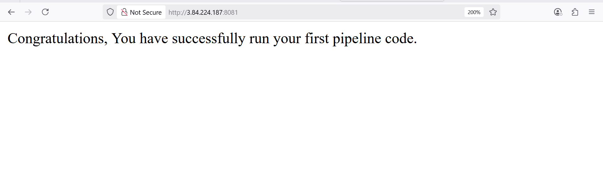

## Jenkins Job

### In Jenkins, a job is a unit of work or a task that can be executed by the Jenkins automation server.

### A Jenkins job represents a specific task or set of tasks that needs to be performed as part of a build or deployment process. Jobs in Jenkins are created to automate the execution of various steps such as compiling code, running tests, packaging applications, and deploying them to servers. Each Jenkins job is configured with a series of build steps, post-build actions, and other settings that define how the job should be executed.

## Creating a Freestyle Project

### 1.  From the dasboard on the left side, click on new

### 2. Creating a freestyle project with name  "my-first-job"

## Connecting Jenkins To Our Source Code Management

### Now that we have created a freestyle project, let connect jenkins with github.

### 1. Create a new github repository called jenkins-scm with a README.md file

### 2. Connecting jenkins to jenkins-scm repository by pasting the repository url in the area selected below, and ensuring  current branch is set to main

### 3. Save configuration and run "build now" to connect jenkins to our repository

### Jenkins successfully connects to Github repository (Jenkins-SCM) and built freestyle job

## Configuring Build Trigger

### As an engineer, we need to be able to automate things and make our work easier in possible ways. We have connected jenkins to jenkins-scm, but we cannot run a new build with clicking on Build Now. To eliminate this, we need to configure a build trigger to our jenkins job. With this, jenkins will run a new build anytime a change is made to our github repository

### 1. Clicking on "Configure" your job and add this configurations

### 2. configuring build trigger to configure triggering the job from GitHub webhook

### 3. Creating Github webhook

### Github webhook configured

### Successfully configured Github webhook

### After change was made on the Github file and pushed to Github. A new build was triggered automatical

